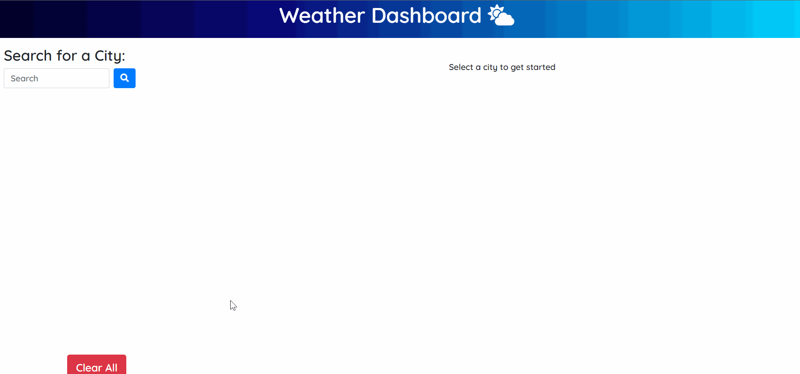

# Weather Dashboard

 

### URL: https://darnocer.github.io/Server-Side-APIs-Weather-Dashboard/

## Description

This application utilizes the [OpenWeather API](https://openweathermap.org/api) to retrieve weather data for cities entered by the user and dynamically updates the weather for the selected city. `localStorage` is used to store user-entered cities as persistent data.

## Table of Contents

- [Usage](#usage)
- [Future Enhancements](#future-enhancements)
- [Credits](#Credits)
- [Tests](#tests)
- [Questions](#questions)

## Usage

- Search for a city in the search bar to see the current weather (conditions, temperature, humidity, wind speed, and UV index) and the 5 day forecast
- Enter multiple cities to build up a list of "favorites". Refresh the page or come back later and the cities will persist, and dynamically update with the current conditions and forecast.
- Switch between cities by selecting from the list
- Clear all cities from localStorage at any time using the "Clear All" button
- UV Index background color updates in accordance with accepted danger levels associated with each value

## Future Enhancements

- Ensure city can be added to list only once

## Credits

- [Bootstrap](https://getbootstrap.com/)

- [Open Weather Map](https://openweathermap.org/api)

- [Font Awesome](https://fontawesome.com/)

- [jQuery](https://jquery.com/)

## Questions?

Contact me at [darian.nocera26@gmail.com](mailto:darian.nocera26@gmail.com)

or 

Copyright © 2020 [Darian Nocera](http://www.github.com/darnocer)

---

##### _Created with [darnocer's README generator](https://github.com/darnocer/Node.js-and-ES6-README-Generator)_ 👽
