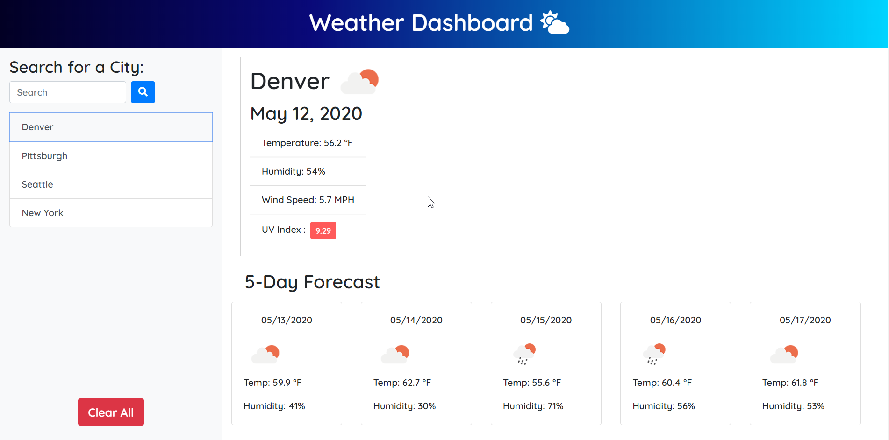

# 06-Server-Side-APIs-Weather-Dashboard

## Deployed Site:

https://darnocer.github.io/Server-Side-APIs-Weather-Dashboard/

## Description

This application utilizes the [OpenWeather API](https://openweathermap.org/api) to retrieve weather data for cities entered by the user and dynamically updates the weather for the selected city. `localStorage` is used to store user-entered cities as persistent data.

- Search for a city in the search bar to see the current weather (conditions, temperature, humidity, wind speed, and UV index) and the 5 day forecast
- Enter multiple cities to build up a list of "favorites". Refresh the page or come back later and the cities will persist, and dynamically update with the current conditions and forecast.
- Switch between cities by selecting from the list
- Clear all cities from `localStorage` at any time using the "Clear All" button
- UV Index background color updates in accordance with accepted danger levels associated with each value



## Acceptance Criteria

```
GIVEN a weather dashboard with form inputs
WHEN I search for a city
THEN I am presented with current and future conditions for that city and that city is added to the search history
WHEN I view current weather conditions for that city
THEN I am presented with the city name, the date, an icon representation of weather conditions, the temperature, the humidity, the wind speed, and the UV index
WHEN I view the UV index
THEN I am presented with a color that indicates whether the conditions are favorable, moderate, or severe
WHEN I view future weather conditions for that city
THEN I am presented with a 5-day forecast that displays the date, an icon representation of weather conditions, the temperature, and the humidity
WHEN I click on a city in the search history
THEN I am again presented with current and future conditions for that city
WHEN I open the weather dashboard
THEN I am presented with the last searched city forecast
```
